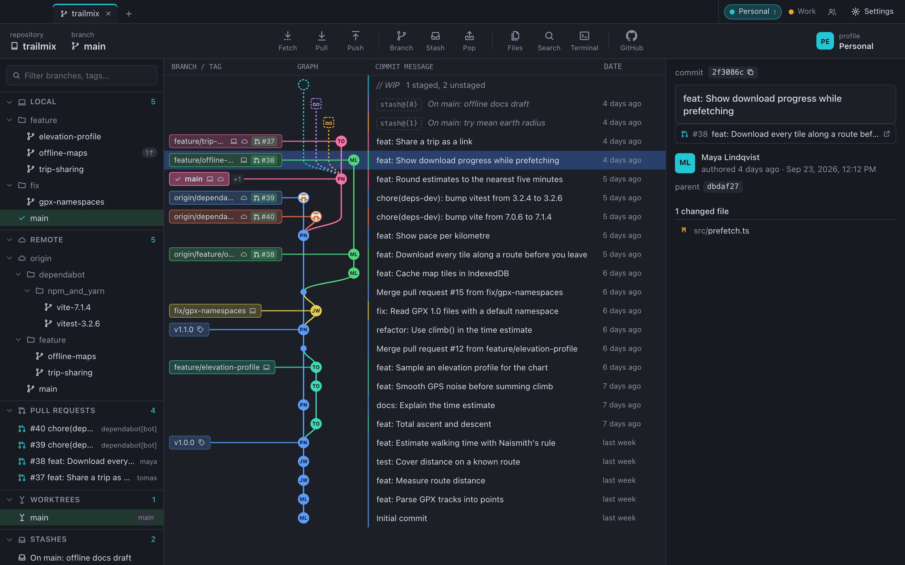
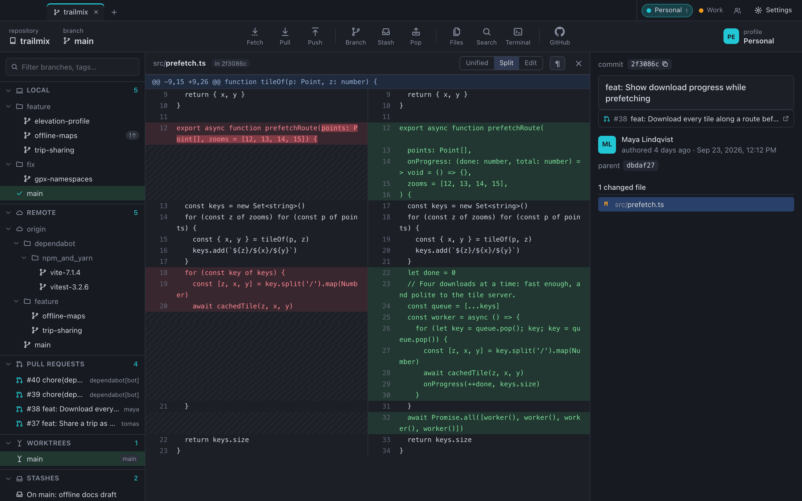
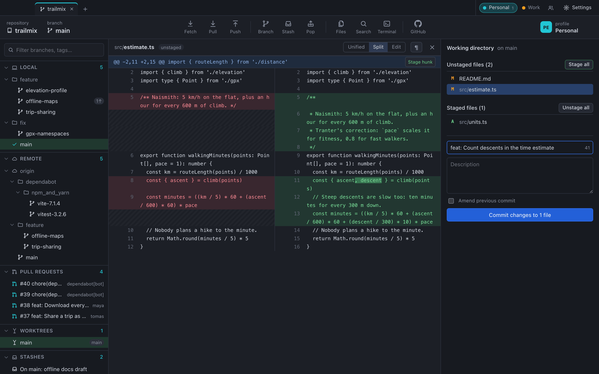
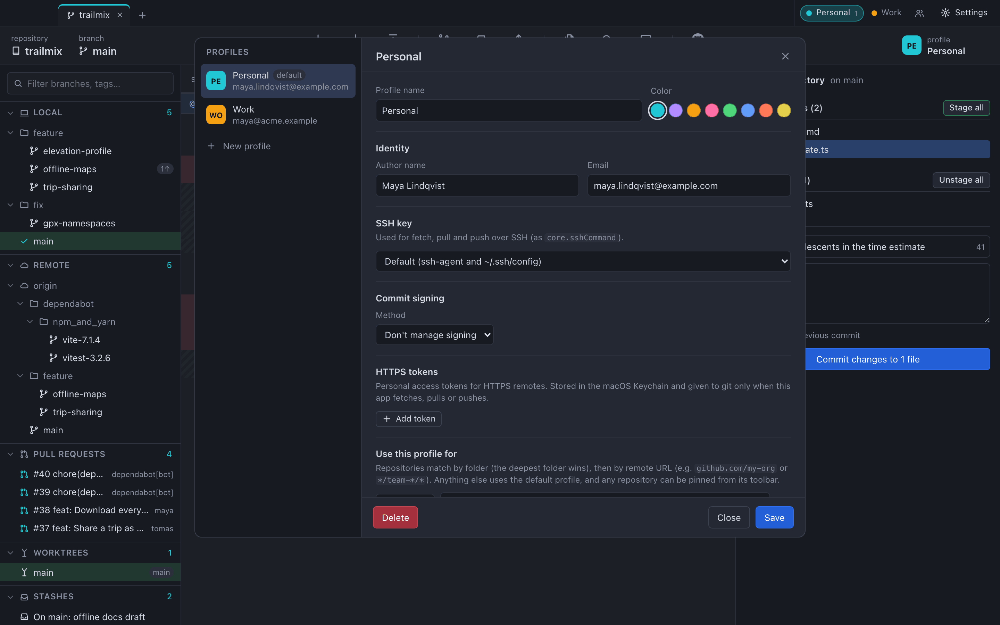
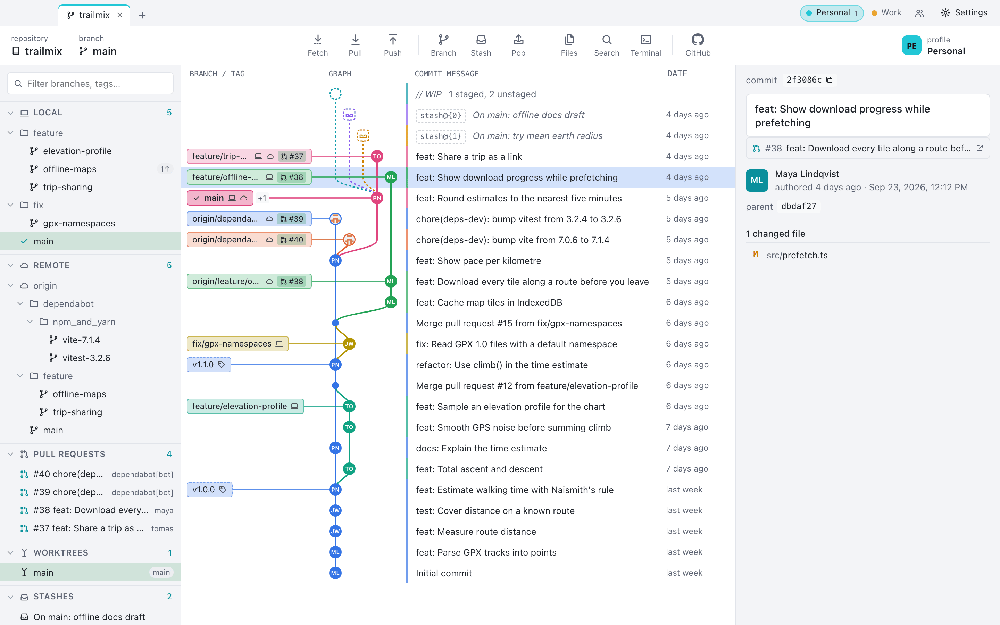

# Git Client

A fast desktop Git client for macOS and Windows. It runs your own `git`, so your config, hooks,
credential helpers, signing and worktrees behave exactly as they do in the terminal.



## Install

### Homebrew (macOS)

```sh
brew install --cask artti-jaakkola/tap/git-client
```

`brew upgrade` then keeps it up to date.

### By hand

Get the latest version from
[Releases](https://github.com/artti-jaakkola/git-client-releases/releases/latest).

**macOS:** open the `.dmg` and drag Git Client to Applications. The app is not signed with an Apple
Developer ID, so macOS blocks the first launch: open System Settings → Privacy & Security and choose
**Open Anyway**.

**Windows:** run the `-setup.exe` (or the `.msi`). The installer is not code-signed, so SmartScreen
may warn: choose **More info → Run anyway**.

Git must be installed; the app uses your own git.

## Features

**History**
- Commit graph of all branches, remote branches, tags and stashes, with colored lanes
- Switch branches and tags with a click; drag one branch onto another to merge or rebase
- Search commits by message, author, id or changed file names, and search file contents
- Browse the files of any commit, with each file's history

**Changes**
- Unified and split diffs that highlight the exact change within an edited line
- Stage and unstage whole files, hunks or single lines
- Hide whitespace-only changes
- Edit working-tree files right in the app
- Commit, amend, and reword earlier commits on the current branch

**Branches and merging**
- Create, rename and delete branches; merge, rebase, cherry-pick, revert and reset
- Resolve merge conflicts in a merge editor, one conflict at a time
- Stash, apply, pop, drop and rename stashes
- Create and open worktrees, each in its own tab

**GitHub and GitLab**
- Clone any of your repositories or projects from a searchable list, or by URL
- Open pull and merge requests shown next to their branches
- Pushing a repository without a remote offers to create it on GitHub or GitLab

**Profiles**
- Keep work and personal identities apart: author, SSH key, commit signing and HTTPS tokens
- Repositories pick their profile by folder or remote URL; each profile has its own tabs
- Tokens are stored in the macOS Keychain or Windows Credential Manager

**And**
- A terminal in the repository, one keystroke away (⌃\`)
- Dark and light themes that follow the system

## Screenshots

Split diff of a commit, with the exact change within each line highlighted:



Staging changes line by line and writing a commit:



Profiles for work and personal repositories:



Light theme:


